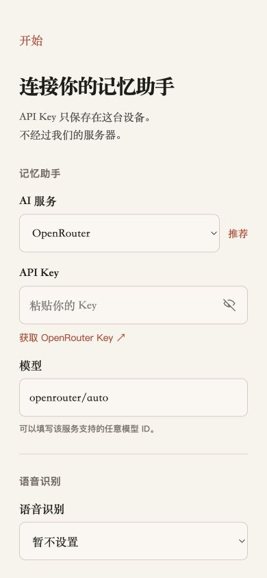

# My Life / 我的一生

一个本地优先、开源的口述记忆助手。你只需要说话或打字；Agent 在后台维护人生时间线、人物、地点、事实与可持续的对话。

它最初是为我的爷爷做的，但不限定年龄，也不试图把回忆做成一门生意。目标只是把“记录一生”的门槛降到开口说话。



## 现在能做什么

- 打开就是持续保存的对话，Agent 每轮先给一条短回应，再继续整理
- 语音转录实时进入可编辑输入框；发送当前一段不会结束整场录音
- 自然语言时间块组成线性时间线；人物和地点是可展开卡片
- 已形成内容可以直接修改；用户的明确要求与亲手编辑始终优先
- 原始录音、原始转录、修正文字和形成内容彼此分开
- 长对话会压缩模型上下文，但不会删除用户可见的完整对话
- Android 和 iPhone 共用一套界面，支持简体中文、繁體中文与 English
- 无中继服务器，无内置 API Key；每个人在自己的设备上填写自己的 Key

## 怎么用

第一次打开时，在设置里选择 AI 服务、填写 API Key 和模型，然后就可以开始说话或打字。

- 记忆 Agent 支持 OpenRouter、OpenAI、阿里云百炼和自定义 OpenAI-compatible endpoint
- OpenRouter 是默认选择，也可以填写该服务支持的任意模型 ID
- Android 实时转录可使用阿里云 `qwen3-asr-flash-realtime`
- iPhone 使用 Apple Speech；不配置语音识别也可以只用文字

应用会从设备直接连接所选服务。项目没有 API 中继，也不会收到用户的 Key；模型或语音服务商仍会收到用户主动发送给它们的内容。

## 数据与导出

记忆内容和录音保存在应用目录。API Key 在 Android 使用 Keystore 加密，在 iPhone 使用 Keychain。

- “聊一聊”导出完整备份：JSON 状态和 WAV 录音会作为独立附件交给系统分享面板
- “我的一生”“我认识的人”“我去过的地方”分别导出对应的 Markdown
- 本地优先不等于模型离线运行；启用云端服务后，相关文字或音频会发送给所选服务商

## 本机运行

需要 Node.js 22 或更高版本。

```bash
npm install
npm test
npm run dev
```

浏览器打开 `http://127.0.0.1:5173/`。Web 版用于检查界面和文字输入。

### Android

需要 JDK 21 和 Android 36 SDK：

```bash
npm run android:debug
```

APK 位于 `android/app/build/outputs/apk/debug/app-debug.apk`。

### iPhone

需要 macOS 和完整 Xcode：

```bash
npm run ios:sync
open ios/App/App.xcodeproj
```

选择 `App` scheme 后从 Xcode 运行。

## License

[MIT](LICENSE)
